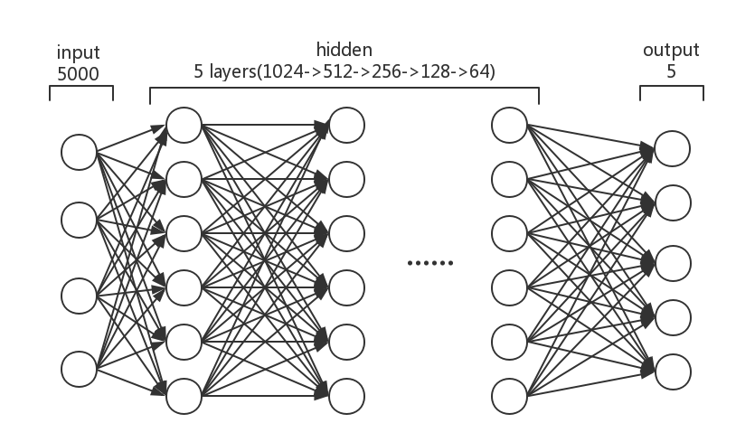
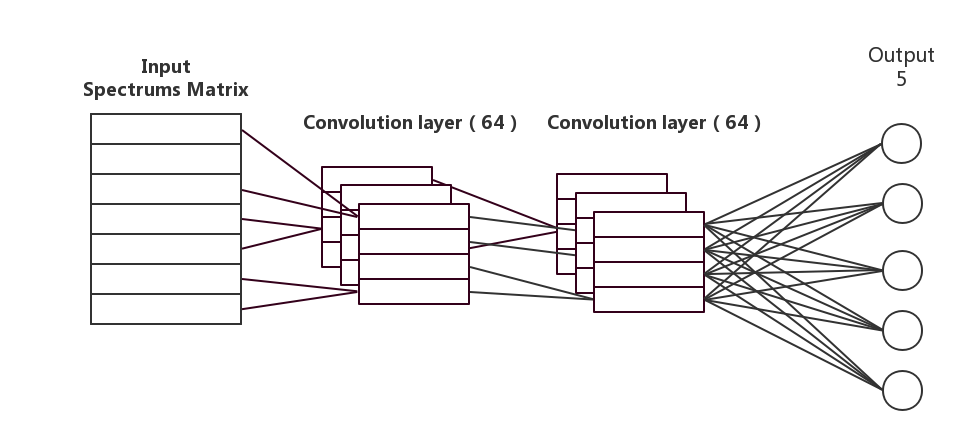
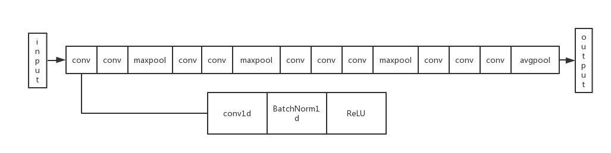
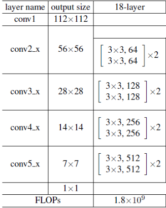

# SpectralClassification

## Intorduction

Use some DNN and CNN networks to classify spectra with different signal-to-noise ratios

Use VGG16 net and res-18 net(change it to one-dimensional)to classify spectra with different signal-to-noise ratios

1.We found that in the case of limited information, the deeper network is not necessarily able to achieve satisfactory 
results, on the contrary, some simple networks can get unexpected surprises.

2.For spectral classification, high SN data often leads to data overfitting and poor generalization ability.

3.Compared with the simple network, the sensitivity of the structure to SNR is lower, and the amount of information 
extracted by the network is negatively correlated with the sensitivity.

If you have some ideas, please contact me 812116298@qq.com. 

## Dataset

<a href="http://skyserver.sdss.org/dr15/en/home.aspx">**SDSS**</a> DR14 data sets of m0-m4 with different SNR were used in the experiment

You can download my <a href="https://pan.baidu.com/s/1L5xOAyoLfI9rYSkreauJ1w">dataset</a> from baidu drive.

type|sn|number
:---:|:---:|:---:
M0|5-10|2850
M0|10-15|1503
M0|up 15|2023
M1|5-10|1919
M1|10-15|1025
M1|up 15|1134
M2|5-10|3300
M2|10-15|1745
M2|up 15|1343
M3|5-10|3105
M3|10-15|1055
M3|up 15|1170
M4|5-10|1658
M4|10-15|779
M4|up 15|603

## Network

### DNN structure

### CNN structure

### VGG-16 structure

### res-18 structure

## Result

DNN 

sn|train acc|test acc
:---:|:---:|:---:
5-10|89.5%|85.7%
10-15|85.6%|87.1%
up15|87.6%|90.3%

CNN network

sn|train acc|test acc
:---:|:---:|:---:
5-10|97.5%|90.8%
10-15|96.6%|94.7%
up15|93.4%|75.4%

vgg16

sn|train acc|test acc
:---:|:---:|:---:
5-10|99.0%|89.0%
10-15|97.8%|90.9%
up15|96.9%|66.9%

res18

sn|train acc|test acc
:---:|:---:|:---:
5-10|98.9%|75.2%

